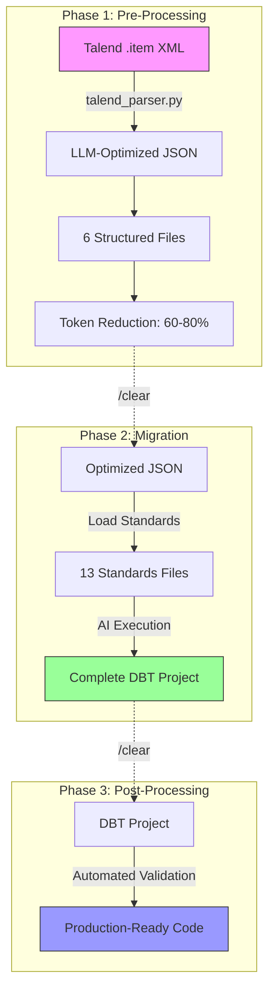

# Talend to DBT Migration Tool

**AI-driven conversion** of Talend ETL jobs into production-ready DBT models for BigQuery using **Claude Code slash commands**.

[](LICENSE)
[](https://docs.claude.com/en/docs/claude-code/slash-commands)
[](https://www.python.org/downloads/)
[](https://www.getdbt.com/)

## What Makes This Different?

This is **not a traditional migration tool**. It's an **AI-powered application** where every step is executed through **Claude Code slash commands** — custom workflows that adapt to your Talend codebase in real-time.

**Three Core Principles:**

1. **AI-Driven Orchestration** — Claude executes migration logic via slash commands, adapting to your specific Talend structure
2. **Standards-Driven Generation** — 13 modular standards files ensure consistent, production-quality output across all migrations
3. **LLM-Optimized Input** — Python parser reduces Talend XML token usage by 60-80%, minimizing AI cognitive load and maximizing accuracy

---

## Quick Start

### Prerequisites
- [Claude Code CLI](https://docs.claude.com/en/docs/claude-code) installed
- BigQuery target platform
- Talend job `.item` files exported

### Setup & Migration

#### Option A: Create New DBT Project

```bash
# 1. Clone repository
git clone https://github.com/yourusername/talend2dbt.git
cd talend2dbt

# 2. Bootstrap environment (run once)
/00-bootstrap

# Clear context after bootstrap
/clear

# 3. Pre-process Talend jobs
/01-pre-process ~/path/to/talend/jobs

# Clear context after pre-processing
/clear

# 4. Generate NEW DBT project
/02-migrate ~/path/to/talend/talend_processed ~/path/to/output/dbt_migrated

# Clear context after migration
/clear

# 5. Validate and format output
/03-post-process ~/path/to/output/dbt_migrated
```

#### Option B: Merge into Existing DBT Project

```bash
# 1-3. Same bootstrap and pre-process steps as above
/00-bootstrap
/clear
/01-pre-process ~/path/to/talend/jobs
/clear

# 4. Merge into EXISTING DBT project
/02-migrate ~/path/to/talend/talend_processed --merge-into ~/existing/dbt_project

# Clear context after migration
/clear

# 5. Validate and format output
/03-post-process ~/existing/dbt_project
```

**Critical**: Always run `/clear` between phases to prevent context overflow.

**Merge Mode Features:**
- Adds new models to existing DBT project structure
- Preserves existing `dbt_project.yml` and `profiles.yml`
- Backs up `_sources.yml` before merging source definitions
- Validates project structure before migration
- Provides conflict detection guidance

---

## Architecture

### Three-Phase AI Pipeline



**Key Components:**

- **talend_parser.py** — Converts raw XML into LLM-friendly JSON (60-80% token reduction)
- **13 Standards Files** — Modular rules enforcing naming, consolidation, SQL quality, architecture
- **4 Slash Commands** — AI-orchestrated workflows executing the migration pipeline

---

## Core Capabilities

### 1. AI-Driven Orchestration
- Claude executes migration via slash commands, not static scripts
- Adapts to variations in Talend structure (custom components, naming patterns)
- Self-correcting: handles errors, edge cases, and complex transformations
- Context-aware decision making (consolidation, layer assignment, dependency resolution)

### 2. Standards-Driven Generation
- **13 modular standards** define every aspect of migration
- Enforces naming conventions, consolidation rules, SQL quality, architecture patterns
- Guarantees consistent output across different Talend projects
- All code generation references standards for compliance

### 3. LLM-Optimized Processing
- Python parser converts Talend XML → structured JSON (60-80% token reduction)
- Extracts semantic information: SQL queries, transformations, dependencies
- Reduces AI cognitive load for higher accuracy
- Enables complex migrations within token limits

---

## Project Structure

```
talend2dbt/
├── .claude/
│   └── commands/          # 4 slash commands (AI orchestration)
├── standards/             # 13 standards files (migration rules)
│   ├── 01_architecture.md
│   ├── 02_naming_conventions.md
│   ├── 03_model_consolidation.md
│   └── ...
├── talend_parser/
│   └── talend_parser.py   # LLM optimizer (2000+ lines)
├── docs/
│   └── slash-commands.md  # Command documentation
├── venv/                  # Python virtual environment
└── README.md
```

---

## Slash Commands

| Command | Purpose | Input | Output |
|---------|---------|-------|--------|
| `/00-bootstrap` | Setup Python environment | None | Virtual environment + dependencies |
| `/01-pre-process` | Extract & optimize Talend XML | Talend `.item` files | 6 structured files (JSON, SQL, YAML) |
| `/02-migrate` | Generate DBT project (new or merge) | Pre-processed files + optional `--merge-into` | Complete DBT project |
| `/03-post-process` | Format, lint, validate | DBT project | Production-ready code + quality report |

**Migration Modes:**
- **New Project**: `/02-migrate <input> [output]` — Creates fresh DBT project
- **Merge Mode**: `/02-migrate <input> --merge-into <existing_project>` — Adds models to existing project

**Learn more**: [Slash Commands Documentation](docs/slash-commands.md)

---

## Standards-Driven Approach

**Every migration references 13 standards files:**

1. **Architecture** — Medallion layer definitions (Bronze → Silver → Gold)
2. **Naming Conventions** — Domain extraction, model naming patterns
3. **Model Consolidation** — Decision tree for job consolidation
4. **SQL Generation** — Completeness requirements, CTE patterns
5. **Component Mapping** — Talend → SQL translation rules
6. **Context Variables** — Variable mapping (Talend → DBT)
7. **File Organization** — Directory structure, schema files
8. **Materialization** — View/table/incremental strategies
9. **Dependencies** — ref() and source() patterns
10. **Quality Validation** — Metrics and validation checks
11. **Error Handling** — Reject flows, audit patterns
12. **Performance** — Partitioning, clustering optimization
13. **Constraints** — Absolute migration rules

**How it works:**
- Slash commands load relevant standards during execution
- Claude follows standards exactly for all code generation
- Violations are flagged and documented
- Ensures consistent output across all Talend projects

---

## Requirements

- **Python**: 3.11+
- **DBT**: 1.10+
- **Target Platform**: BigQuery (2025 syntax)
- **Claude Code**: Latest version

**Dependencies** (auto-installed by `/00-bootstrap`):
- pyyaml, tiktoken, dbt-core, dbt-bigquery
- sqlfluff, sqlfluff-templater-dbt
- yamllint, mdformat, mdformat-gfm

---

## Documentation

- **[Slash Commands Guide](docs/slash-commands.md)** — Detailed command documentation
- **[Standards README](standards/README.md)** — Migration rules and patterns
- **[CLAUDE.md](CLAUDE.md)** — Codebase guidance for contributors

---

## Contributing

Contributions welcome! Please:
1. Read [CLAUDE.md](CLAUDE.md) for codebase guidance
2. Test changes on sample Talend projects
3. Update relevant standards files if changing migration logic
4. Submit PR with description of changes

---

## License

MIT License - see [LICENSE](LICENSE) file for details.

---

## Support

- **Issues**: [GitHub Issues](https://github.com/MisterTK/talend2dbt/issues)
- **Questions**: Open a discussion in GitHub Discussions
- **Claude Code Help**: [Claude Code Documentation](https://docs.claude.com/en/docs/claude-code)
