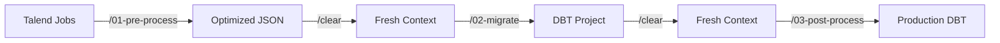

# Claude Code Slash Commands

This repository includes **4 custom slash commands** that drive the entire Talend-to-DBT migration process. These commands are **AI-powered workflows** executed by Claude Code, not traditional shell scripts.

## What are Slash Commands?

Slash commands are Claude Code's way of packaging complex, multi-step workflows into simple executable commands. Learn more: [Claude Code Slash Commands Documentation](https://docs.claude.com/en/docs/claude-code/slash-commands)

**Key Differences from Shell Scripts:**
- **AI-Driven**: Claude executes the command logic, adapting to your specific codebase
- **Context-Aware**: Commands reference standards and documentation to ensure consistency
- **Self-Correcting**: Claude can handle errors and edge cases during execution
- **Reproducible**: Same command produces consistent results across different Talend projects

## Available Commands

### `/00-bootstrap`

**Purpose**: Setup Python virtual environment and install all dependencies

**Usage**:
```bash
/00-bootstrap
```

**What it does**:
- Detects or installs Python 3.11+
- Creates isolated virtual environment in `venv/`
- Installs all required packages (dbt-core, dbt-bigquery, sqlfluff, yamllint, etc.)
- Verifies installation with package imports

**When to use**: Once per project, before starting migration

**After completion**: Run `/clear` to free up context before next phase

---

### `/01-pre-process`

**Purpose**: Extract and optimize Talend XML into LLM-friendly format

**Usage**:
```bash
/01-pre-process <path/to/talend/jobs> [output_path]
```

**Arguments**:
- `talend_jobs_path` (required): Directory containing Talend `.item` files
- `output_path` (optional): Output directory (default: `<talend_jobs>/talend_processed`)

**What it does**:
- Parses all Talend `.item` XML files recursively
- Extracts SQL queries, tMap transformations, context variables
- Analyzes job hierarchy, dependencies, complexity
- Generates 6 optimized output files for Phase 2

**Output Files**:
1. `talend_extraction.json` - Complete job structure and metadata
2. `sql_queries.sql` - All extracted SQL with annotations
3. `transformations.json` - tMap business logic
4. `context_to_dbt.yml` - Context variable mappings
5. `extraction_summary.txt` - Human-readable summary
6. `token_statistics.txt` - Token reduction analysis

**After completion**: Run `/clear` to free up context before Phase 2

---

### `/02-migrate`

**Purpose**: Generate complete DBT project with 98%+ SQL coverage

**Usage**:
```bash
/02-migrate <processed_talend_path> [dbt_output_path]
```

**Arguments**:
- `processed_talend_path` (required): Directory from Phase 1 output
- `dbt_output_path` (optional): DBT project directory (default: `<processed_talend_path>/../dbt_migrated`)

**What it does**:
- **Phase 1**: Analyzes job structure, extracts domains, classifies jobs
- **Phase 2**: Creates DBT project structure and configuration
- **Phase 3**: Generates staging models (Bronze layer)
- **Phase 4**: Generates intermediate models (Silver layer) with consolidation
- **Phase 5**: Generates marts models (Gold layer) - dimensions and facts
- **Phase 6**: Creates macros, tests, documentation
- **Phase 7**: Validates quality metrics and standards compliance
- **Phase 8**: Produces migration report

**Standards Compliance**:
- References 13 modular standards files in `/standards/`
- Enforces naming conventions, consolidation rules, SQL completeness
- Validates against absolute constraints

**Output Structure**:
```
dbt_migrated/
├── models/
│   ├── staging/          # Bronze: 1:1 source mappings
│   ├── intermediate/     # Silver: Business logic
│   └── marts/            # Gold: Facts and dimensions
├── macros/               # Custom Talend compatibility functions
├── tests/                # Data quality tests
├── docs/                 # Migration documentation
├── dbt_project.yml       # DBT configuration
└── profiles.yml          # BigQuery connection
```

**After completion**: Run `/clear` to free up context before Phase 3

---

### `/03-post-process`

**Purpose**: Format, lint, and validate DBT migration output

**Usage**:
```bash
/03-post-process <dbt_project_path>
```

**Arguments**:
- `dbt_project_path` (required): DBT project directory from Phase 2

**What it does**:
- **SQL Linting**: Runs sqlfluff with BigQuery dialect, auto-fixes formatting
- **YAML Validation**: Validates all schema files with yamllint
- **DBT Parsing**: Compiles and validates project structure
- **Markdown Formatting**: Formats all documentation with mdformat
- **Quality Report**: Generates `QUALITY_REPORT.md` with validation results

**Automated Fixes**:
- SQL indentation, line length, aliasing
- YAML syntax errors
- Deprecated DBT 1.10 test syntax
- Markdown formatting inconsistencies

**After completion**: Project is production-ready for BigQuery deployment

---

## Migration Pipeline Flow



**Critical**: Always run `/clear` between phases to prevent context overflow

## Command Internals

Each slash command is defined in `.claude/commands/` as a Markdown file with:

- **Description**: One-line summary
- **Argument Hint**: Usage pattern
- **Allowed Tools**: Which Claude tools can be used (Bash, Read, Write, etc.)
- **Execution Steps**: Detailed workflow with code blocks

**Example Structure** (`.claude/commands/01-pre-process.md`):
```markdown
---
description: Pre-process Talend .item files into LLM-optimized format
argument-hint: <talend_jobs_path> [output_path]
allowed-tools: Bash, Read, Write, Edit, Glob, Grep, TodoWrite
---

# Command Details
[Detailed execution steps...]
```

## Why Slash Commands?

**Traditional Approach** (shell scripts):
- Brittle: Breaks on edge cases
- Manual: Requires human intervention for errors
- Static: Same logic for all inputs

**Slash Commands Approach** (AI-driven):
- Adaptive: Claude handles variations in Talend structure
- Self-Healing: Can recover from errors and adjust strategy
- Context-Aware: References standards and documentation dynamically
- Intelligent: Makes consolidation decisions based on business logic

**Example**:
- Shell script: "Extract all tMap components" → Fails on custom components
- Slash command: "Extract tMap transformations" → Claude identifies variations, adapts parsing logic, validates output

## Extending Commands

To customize a slash command:

1. Edit the corresponding file in `.claude/commands/`
2. Update execution steps, constraints, or validation logic
3. Commands are immediately available (no compilation needed)

**Best Practices**:
- Keep commands focused on a single phase
- Document all assumptions and constraints
- Use TodoWrite tool for complex multi-step commands
- Reference standards files for consistency

## Standards Integration

All slash commands reference the `/standards/` directory:

| Standard File | Used By | Purpose |
|--------------|---------|---------|
| `01_architecture.md` | `/02-migrate` | Medallion layer definitions |
| `02_naming_conventions.md` | `/02-migrate` | Domain extraction, model naming |
| `03_model_consolidation.md` | `/02-migrate` | Consolidation decision tree |
| `04_sql_generation.md` | `/02-migrate` | SQL completeness, CTE patterns |
| `05_component_mapping.md` | `/02-migrate` | Talend → SQL translation |
| `06_context_variables.md` | `/02-migrate` | Context → DBT variable mapping |
| `07_file_organization.md` | `/02-migrate` | Directory structure |
| `08_materialization.md` | `/02-migrate` | View/table/incremental strategy |
| `09_dependencies.md` | `/02-migrate` | ref() and source() patterns |
| `10_quality_validation.md` | `/02-migrate`, `/03-post-process` | Validation metrics |
| `11_error_handling.md` | `/02-migrate` | Reject flows, audit patterns |
| `12_performance.md` | `/02-migrate` | Partitioning, clustering |
| `13_constraints.md` | `/02-migrate` | Absolute migration rules |

**How it works**:
1. Slash command includes reference: `@standards/01_architecture.md`
2. Claude loads the standards file during execution
3. All code generation follows standards exactly
4. Violations are flagged and documented

## Debugging Commands

To see what a command will do:

1. **Read the command file**: `cat .claude/commands/01-pre-process.md`
2. **Check execution steps**: Look for bash/Python code blocks
3. **Review constraints**: Check "Success Criteria" and "Validation" sections

**Common Issues**:
- **Command not found**: Ensure file is in `.claude/commands/` and ends with `.md`
- **Unexpected behavior**: Check if standards files have been modified
- **Context overflow**: Run `/clear` between phases

## Performance Tips

- **Run commands sequentially**: Don't skip phases
- **Always clear context**: Between phases to prevent token overflow
- **Pre-validate inputs**: Ensure Talend files are well-formed before Phase 1
- **Review migration report**: Before running Phase 3

## Additional Resources

- [Claude Code Documentation](https://docs.claude.com/en/docs/claude-code)
- [Slash Commands Guide](https://docs.claude.com/en/docs/claude-code/slash-commands)
- [Standards Directory](../standards/README.md)
- [Talend Parser Documentation](../talend_parser/README.md)
